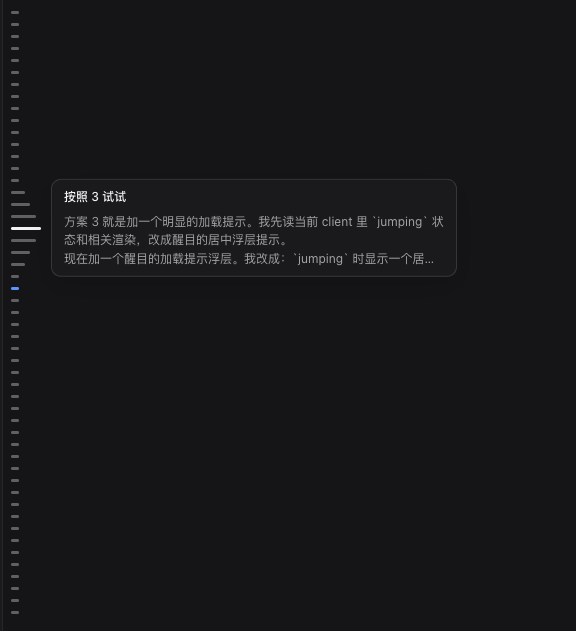

# @hzpeng/dsh-lens-rail

[English](README.md) · [简体中文](README.zh-CN.md)

A Codex-style **LEFT** message navigation rail for the DeepSeek Harness (DSH) Web
conversation column.



A vertical column of short horizontal lines runs down the **left** edge of the
transcript — one line per message, including both your turns **and** the agent's
replies. It is a scroll-spy scrubber: the line under your current reading
position is highlighted in the brand colour, hovering grows the line under the
cursor while its neighbours taper smoothly toward the edges (the Codex "lens"
effect), and clicking any line jumps the transcript to that message (paging
older history when necessary).

## Features

- **Left edge** placement — `left: calc(var(--dsh-sidebar-width) + 4px)`, so it
  sits beside the conversation column and never overlaps the app sidebar.
- **One line per message** — both user turns (`user` nodes) and agent replies
  (`assistant` nodes) get a line; tool rows, commands, and turn-tails are
  skipped so the rail reads as a conversation, not a step ledger.
- **Lens hover** — the focused line is longest; neighbours taper off with a
  gaussian profile (`width = base + amp * exp(-d²/2σ²)`), exactly the Codex
  effect.
- **Scroll-spy highlight** — the line nearest the 40% viewport line is active
  (brand colour + glow) and follows your reading position.
- **Click to jump** — `loadOlder` pages older history on demand, then scrolls
  the target row into view; shows a small spinner while a long jump loads.
- **Theme-aware** — uses DSH alias tokens (`--dsw-alias-*`) so light and dark
  themes both look right.

## Install

The plugin mounts through a `cordis.patch.yml` insert and must resolve from the
profile's dependency tree (`$DSH_HOME/profiles/node_modules`).

```bash
# from the plugin directory, add it to your web profile's dependencies
# $DSH_HOME/profiles/web/package.json
#   "dependencies": { "@hzpeng/dsh-lens-rail": "file:../../workspace/dsh-lens-rail" }

# then mount it
# $DSH_HOME/profiles/web/cordis.patch.yml
#   - insert:
#       - id: dsh-lens-rail
#         name: '@hzpeng/dsh-lens-rail'
```

Restart `dsh web` and hard-refresh the browser. The client bundle is served
runtime from `/plugins/dsh-lens-rail/client.js`, so no rebuild of the DSH web
shell is needed — only a process restart to pick up the new loader entry.

Alternatively use the built-in installer:

```bash
dsh plugin --profile web add @hzpeng/dsh-lens-rail
```

## Uninstall

Remove the `- insert: { id: dsh-lens-rail, ... }` block from
`$DSH_HOME/profiles/web/cordis.patch.yml` and drop the dependency from
`package.json`, then restart `dsh web`.

## License

MIT
